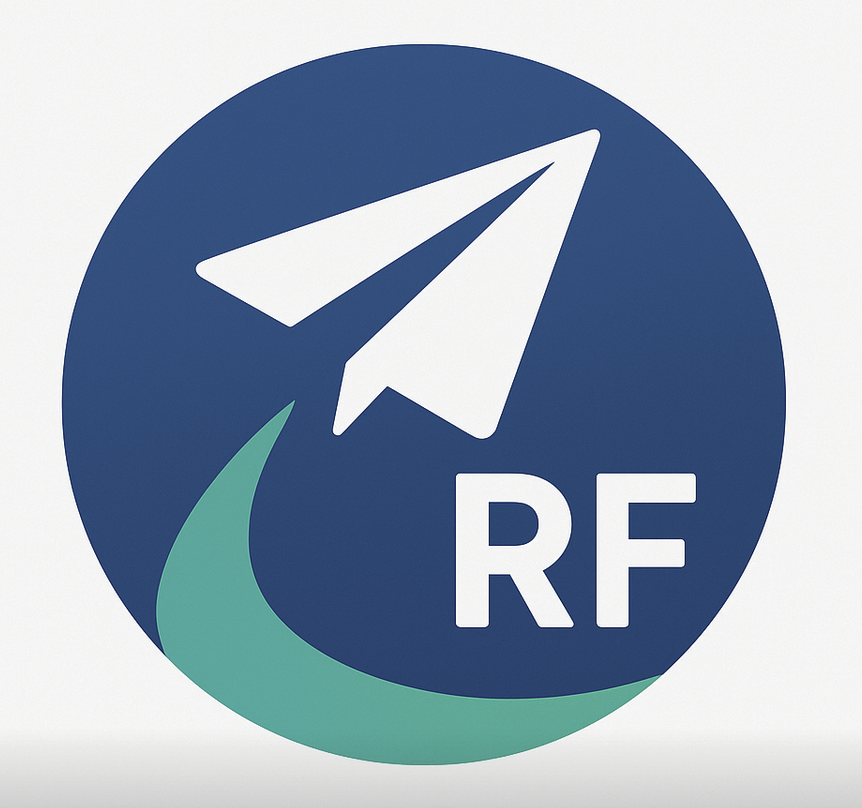

# ReadyFlight


An Electron application with React and TypeScript


## Project Setup

### prerequisites

> [!WARNING] 
> I have no idea what version of node is required. Someone else will need to edit this at some point

- [bun](https://bun.com/)
- probably node 22 ??


### Install
Once you have the repository open, you can install the dependencies with the following command

```bash
$ bun i
```
Once the dependencies are installed, proceed to the next section.


### Development

To run the electron app in development mode, run the following

```bash
$ bun run dev
```

You can run individual segments of the app if you wish.

> [!NOTE]
> You will need to have each segment running in a separate terminal window

```bash
$ bun run dev:web
$ bun run dev:backend
```


### Build
To create distribution builds, run the following commands
```bash
# For windows
$ npm run build:win

# For macOS
$ npm run build:mac

# For Linux
$ npm run build:linux
```

## Project Layout

The codebase is split into the following four sections:
- `client-backend`
- `client-frontend`
- `electron`
- `libs`

Each section has its own purpose, and each are explained in detail below.

### client-backend

Contains the client side code for handling telemetry IO and forwarding to the client frontend.

### client-frontend

React application for the GCS, responsible for displaying live telemetry, advanced mission planning, UAV configuration, flight log investigation, and more

### electron

the configuration for pulling together the client frontend and client-backend

### libs

Contains non UI code that handles everything from capitalisation, to really fancy dubins maths